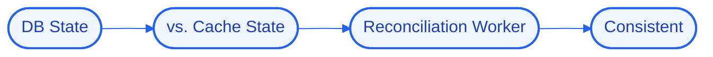

# SyncGuard
### Cache-consistency reconciliation between the database and the cache.


## 📖 Overview
SyncGuard reconciles cache against the database of record, detecting and repairing divergence so read-through/write-aside caching stays correct.

> Part of my Senior Hybrid Engineer 2026 portfolio (`#50`). Built on the "Antigravity" model — logic, state, and UI run locally in Docker while heavy reasoning is offloaded to cloud APIs, so the whole system runs on modest hardware.

## 🚀 Quick Start
```bash
# 1. Clone
git clone https://github.com/Kimosabey/sync-guard.git
cd sync-guard

# 2. Install
# (see docs/GETTING_STARTED.md for the full setup)

# 3. Run
docker compose up
```

## ✨ Key Features
- DB-vs-cache divergence detection
- Reconciliation worker
- Write-through / write-aside patterns
- Staleness bounds

## 🏗️ Architecture


Keeping cache and source of truth consistent under concurrent writes without locking everything.

See [docs/ARCHITECTURE.md](./docs/ARCHITECTURE.md) for the full HLD/LLD and design decisions.

## 🧰 Tech Stack
| Layer | Technology | Role |
| :--- | :--- | :--- |
| Postgres | `Postgres` | Relational source of truth |
| Redis | `Redis` | In-memory store / cache / queue |

## 📚 Documentation
- [Architecture](./docs/ARCHITECTURE.md) — high- and low-level design, decision log
- [Getting Started](./docs/GETTING_STARTED.md) — prerequisites, setup, environment
- [Failure Scenarios](./docs/FAILURE_SCENARIOS.md) — fault analysis and recovery
- [Interview Q&A](./docs/INTERVIEW_QA.md) — deep-dive walkthrough

## 🔭 Future Enhancements
- Event-driven invalidation
- Consistency metrics
- Configurable repair policy

## 📄 License
Released under the MIT License.

## 👤 Author

**Harshan Aiyappa**
Senior Full-Stack Hybrid AI Engineer
Voice AI • Distributed Systems • Infrastructure

[](https://kimo-nexus.vercel.app/)
[](https://github.com/Kimosabey)
[](https://linkedin.com/in/harshan-aiyappa)
[](https://x.com/HarshanAiyappa)
